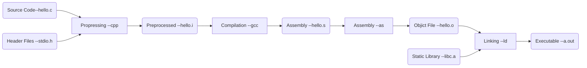

# 程序员的自我修养

## 第一章 温故而知新

**北桥芯片**：最开始的计算机只有一个总线 ，将CPU、内存、显示器和键盘等I/O设备连接到一起，因为当时的设备频率和带宽都很低，所以这样做并没有什么问题。后来又出现了高频率的CPU，本来CPU只需要倍频就可以在总线上与其他设备通信，而随着技术的发展又出现了图形芯片，等等各种高带宽需求的设备，使得当前的慢速I/O总线已经无法满足需求，人们就发明了**北桥芯片**，以便能够高速的进行数据交换。

**南桥芯片**: 因为北桥芯片的允许速度非常高，所有相对低速的设备如果都连在北桥 上，北桥又要处理高速设备又要处理低速设备，会导致设计十分复杂，于是人们就设计了**专门处理低速设备的南桥芯片**，用来连接磁盘、USB、键盘等设备。

后来又出现了PCI总线和AG、PCIE总线等。其中PCI bridge其实就是北桥。

## 第二章 编译和链接

**构建（build）程序的四个步骤**：预处理（prepressing）、编译（Compilation）、汇编（Assembly）和链接（Linking）如下图所示。

